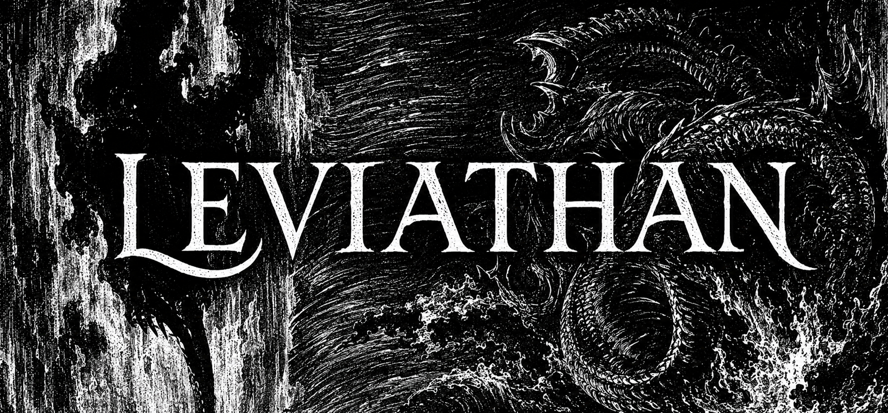
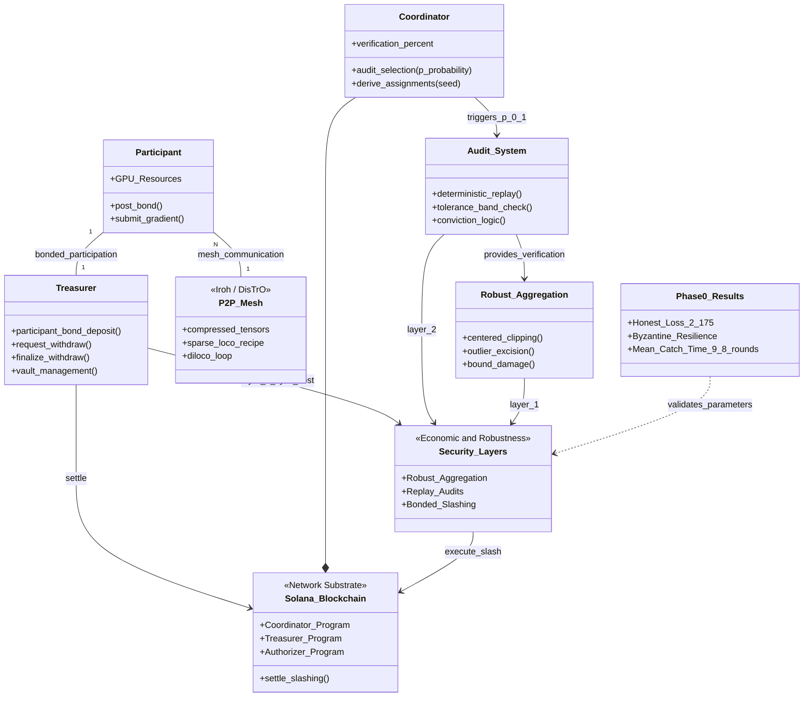

<p align="center">
    
</p>

<h1 align="center">Leviathan</h1>

<p align="center"><b>Trustless training for the People's model.</b></p>

Frontier AI is produced inside five balance sheets. The mathematics of training over the open internet is already solved and shipping; what remains unsolved is trust. Nobody has made it safe to accept a gradient from a stranger and pay them for it.

Leviathan is a Solana-coordinated training network where anyone with a GPU joins by posting a bond, earns Proof of Gradient for contributions that survive verification, and loses the bond if they lie. The chain carries commitments, audits and money. The mesh carries compressed tensors. The model belongs to the network that trained it.

Hobbes drew Leviathan as a giant composed of thousands of individuals. This one is composed of thousands of GPUs.

> This repository is `leviathan-net`, the network substrate: a fork of [PsycheFoundation/nousnet](https://github.com/PsycheFoundation/nousnet) (Apache-2.0) that carries the layer upstream designed but left unimplemented. The vision, whitepaper, simulation and phase plan live in the private [wienerlabs/leviathan](https://github.com/wienerlabs/leviathan) repository.

## The open slot

Every live decentralized-training network picked one column. Nobody picked both.

| | Verification guarantees | Live economics (bonds, slashing) |
|---|---|---|
| Bittensor training subnets | scoring gates, admitted gaps | emissions only, no bonds |
| Nous Psyche | witness liveness, verifier is a `todo!()` | no stake, dead slash code, whitelist |
| Gensyn Verde | strong, FP32 single-GPU determinism | pre-mainnet |
| OVIG | tolerance-band replay audits | a paper, not a network |
| **Leviathan** | **OVIG-style replay audits** | **bonds sized (1-p)/p, live slashing** |

The combination of bonded contributions, random replay audits and slashing is not run by anyone for live LLM training today. That is the entire moat, and every piece is individually proven in public work from 2024 to 2026.

## Security model

Three layers, each covering the others' gap:

1. **Robust aggregation bounds damage.** Centered clipping with far-outlier excision caps any contribution's influence radius in the round it happens. Re-validated on real transformer gradients: a 5/16 sign-flip coalition drives naive mean to divergence while clip plus excision holds the honest baseline and admits 3% of malicious contributions.
2. **Replay audits price lying.** Each contribution is audited with probability p. Local rounds are replayable pure functions of `(checkpoint, seed, data)`, so a mismatch beyond the calibrated tolerance band is a binary fraud proof. On the ALIE run at p = 0.1, all five stealth cheaters were caught at a mean of 9.8 rounds against the 1/p = 10 expectation.
3. **Bonds make sybil a cost.** Break-even bond = reward x (1-p)/p. A slashed identity re-enters only by posting a fresh bond, and slashed stake funds the verifiers hunting it. Security is self-funding under attack.

This is economic security with published parameters, never a cryptographic overclaim.

## Architecture



## What lives here

This fork carries the layer upstream left as dead code, wired to the reward engine and covered by the in-process `memnet` test harness (no validator required).

| Component | State |
|---|---|
| Bonded participation (`solana-treasurer`) | `participant_bond_deposit`, `request_withdraw`, `finalize_withdraw` with a challenge window; settlement forfeits slashed collateral into the run vault |
| Audit lottery (`shared/coordinator`) | `audit_selection` derives verifier-to-target assignments from the round seed, deterministic and replayable; audit pressure scales with `verification_percent` |
| Dispute and slash (`solana-coordinator`) | `slash_client` convicts a client, ejection carries into `exited_clients` where the slashing rate applies; the `slashed` counter upstream never read now has a live producer |

Upstream's verifier dispatch was `Committee::Verifier => todo!()`, its `verification_percent` was pinned to zero by an assert, `ClientState::Ejected` was never set by any path, and the `slashed` counter no program read. All four are now live.

## Devnet deployment

| Program | ID |
|---|---|
| coordinator | `JD9rHTiqBFgHjViWZc7gFZX74LvKKysbLbqFRaFvtmmN` |
| authorizer | `2Kg5ERG6ubuzyPmQ24axsws7V2ja2EvWp5CHMKFCrTxv` |
| treasurer | `9A1kc8Dr9dFJW9t1npAk7EHrADm6TAyFeVLH27CDdvv8` |

Programs build with `anchor build --no-idl`. The instruction layers are exercised end to end by the `memnet` suites:

```
cargo test -p psyche-solana-tooling
```

The whole security economics also runs against live devnet through the toolbox RPC endpoint:

```
cargo run -p psyche-solana-tooling --bin devnet-conviction-demo --features demo
```

A verified run: a participant posts a bond of 500, the run authority convicts it mid-epoch through the treasurer, the coordinator writes `slashed = 200` at epoch end, and the bond withdrawal returns 300 while the forfeited 200 stays in the run vault as reward liquidity. The complete cross-program loop, on live chain.

## Lineage

Built on the shoulders of, and differentiated from, PsycheFoundation/nousnet (Apache-2.0): the Solana coordinator, iroh P2P mesh, and Rust DisTrO compression are inherited; the bond, audit and slash layers are ours. The compression recipe follows SparseLoCo over a DiLoCo outer loop; the inference path follows vLLM workers verified by TOPLOC. This repository remains Apache-2.0; see [LICENSE](./LICENSE) and [NOTICE](./NOTICE).

Private under the wienerlabs organization while Phase 1 lands.
